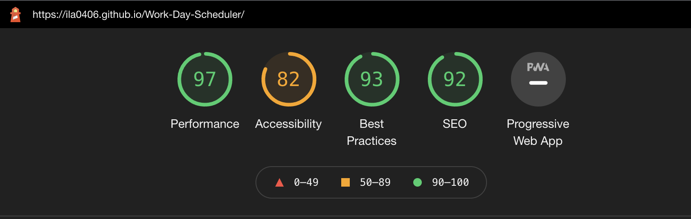
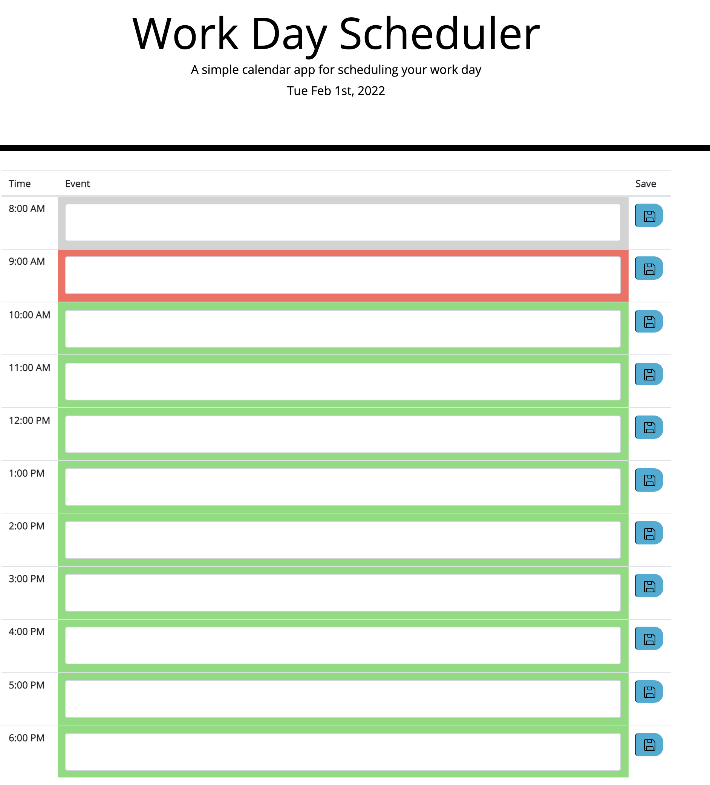
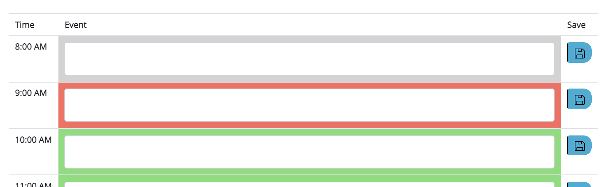
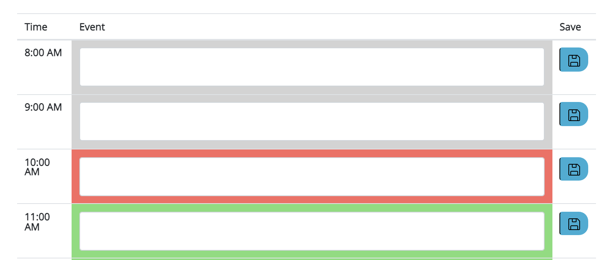
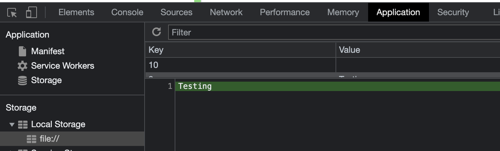

# Work Day Scheduler
https://ila0406.github.io/Work-Day-Scheduler/

# Description
Work Day Scheduler is an website that allows an employee to keep track of their busy schedule. Between the hours of 8am and 6pm, the employee can add text inside the event blocks. Clicking on the 'save' icon will store the event in local storage. Throughout the day the events will change color based on whether the event is in the past, future, or current. 

## User Story
As an employee with a busy schedule, I want to add important events to a daily planner so that I can manage my time effectively.

## Technologies Used
CSS, HTML, Javascript, moment.js, jQuery

## Accessibility
Lighthouse report on accesibility

## Mock-Up 
The following images shows the mokup of the web application's appearance and functionality. 

### Mockup

### Current Day
When the planner is opened, the current day is displayed at the top of the calendar.

### Color coded
When viewing the timeblocks for the day, the colors change based on past, present, future

### Save the time block
When the save button is clicked, the event is saved in local storage

## Questions
email: ila0406@gmail.com
