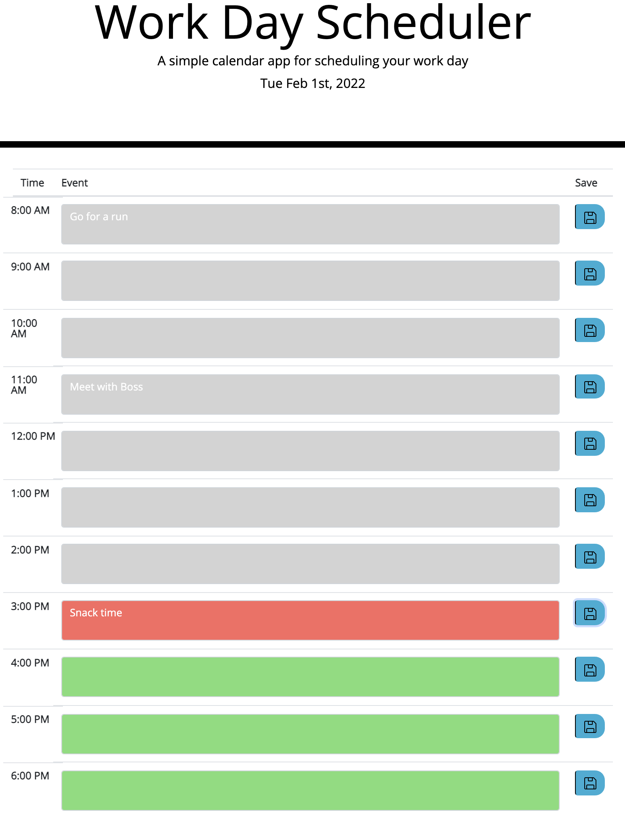

# wk5-Homework-DH
Homework repo for wk5 - Third Party APIs: Work Day Scheduler
https://ila0406.github.io/Work-Day-Scheduler/

## User Story
As an employee with a busy schedule, I want to add important events to a daily planner so that I can manage my time effectively.

## Accessibility
Lighthouse report on accesibility

## Mock-Up 
The following images shows the mokup of the web application's appearance and functionality. 

### Mockup

### Current Day
When the planner is opened, the current day is displayed at the top of the calendar.

### Color coded
When viewing the timeblocks for the day, the colors change based on past, present, future

### Save the time block
When the save button is clicked, the event is saved in local storage

